```{r setup, include=FALSE}
knitr::opts_chunk$set(echo = FALSE)
```

## about Ed


```{r, echo=FALSE, out.width="60%", fig.cap=""}


```


- Statistician, agri-tech applications, ecology and conservation

- 'Research active'

- I take teaching seriously, but like it too

- MSc stats module & others, leader Data Science MSc

- Fun: motorcycling, 'twitching' (bird watching), raising sheep


twitter @edharris9000

## overview

<center>


```{r, echo=FALSE, out.width="80%", fig.cap=""}
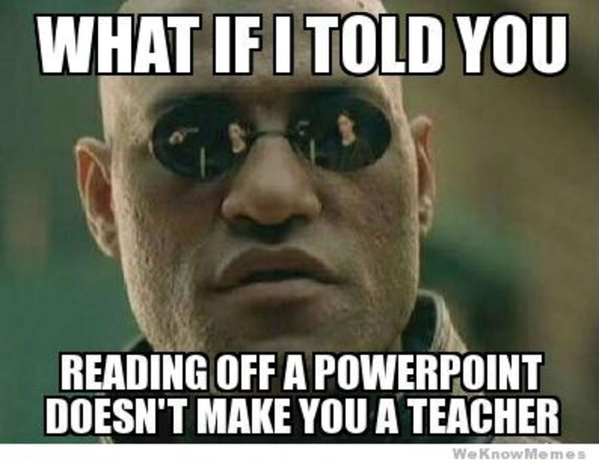
```

</center>

## overview

&nbsp;

- (2 big ideas) learning styles concept

- (5 things that work) a bag of tricks

- (2 things to avoid) pitfalls


## learning styles concept

*Big idea # 1* Dunn 1984 "learning styles" exist

<center>

```{r, echo=FALSE, out.width="80%", fig.cap=""}
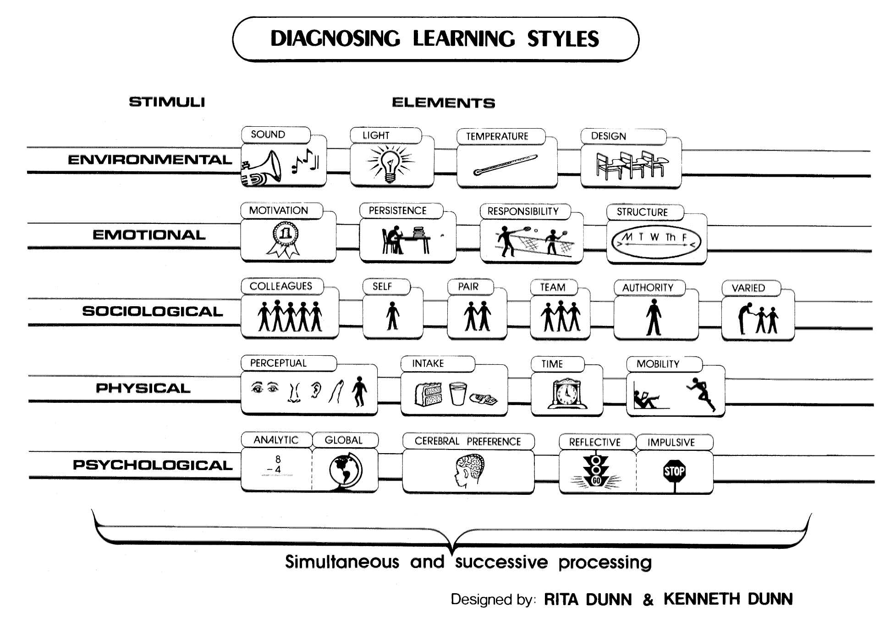
```

</center>

## learning styles concept

*Big idea # 1* Dunn 1984 "learning styles" exist

- individual students differ

- different teaching methods

- the *optimal teaching method* may differ between students

- is it therefore possible some teaching methods advantage some students relative to others?

## learning styles concept

<center>

Traditional teaching styles

```{r, echo=FALSE, out.width="70%", fig.cap=""}
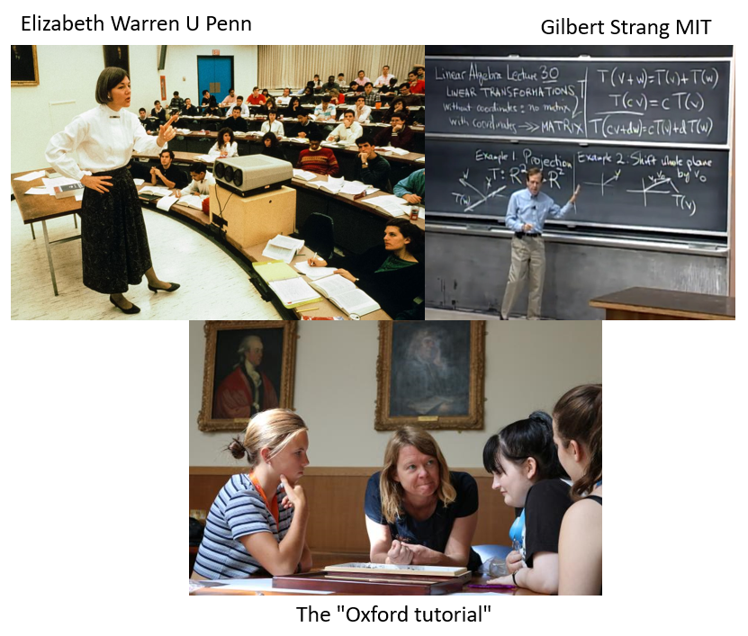
```

</center>

## learning styles concept

*Big idea # 2* Moskal et al. 2013 "blended learning"

> **Blended learning** is a dangerous idea in that it challenges
the status quo, maintaining the integrity of the traditional
academy while simultaneously encouraging **the adoption of platforms**
**such as online learning, mobile technologies and resources**
**that exist in the cloud**

<center>

```{r, echo=FALSE, out.width="60%", fig.cap=""}
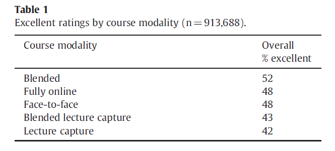
```

</center>

## humble intention


<center>

My name is Ed.  And I am here to teach you statistics.

```{r, echo=FALSE, out.width="50%", fig.cap=""}

```

</center>

## the challenge is real


<center>

"I milk cows for a living.  Why are you teaching me to do computer programming?"

```{r, echo=FALSE, out.width="30%", fig.cap=""}
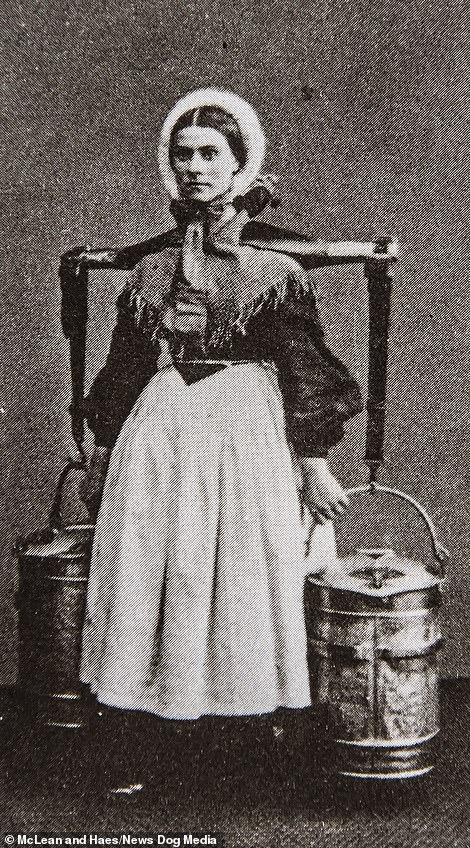
```

</center>

## a bag of tricks


<center>

```{r, echo=FALSE, out.width="85%", fig.cap=""}
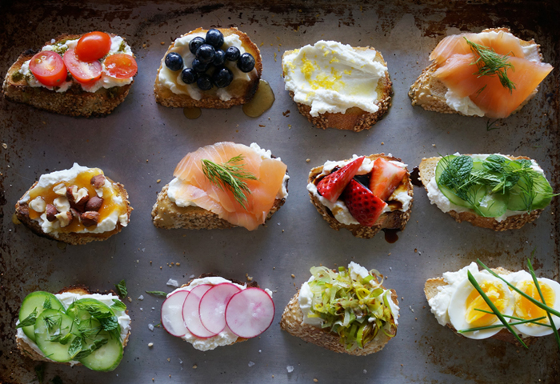
```

</center>

## a bag of tricks

***Trick # 1* Communication <br>
(I use Slack, Moodle forum, email, etc.)**

Must be sustainable, be consistent, make it easy for yourself

<center>

```{r, echo=FALSE, out.width="80%", fig.cap=""}

```

</center>

## a bag of tricks

***Trick # 2* Feedback (multiple modes, don't skimp)**

Must be sustainable, be consistent, make it easy for yourself

(also, consructive alignment e.g. Biggs 1996)

<center>

```{r, echo=FALSE, out.width="80%", fig.cap=""}
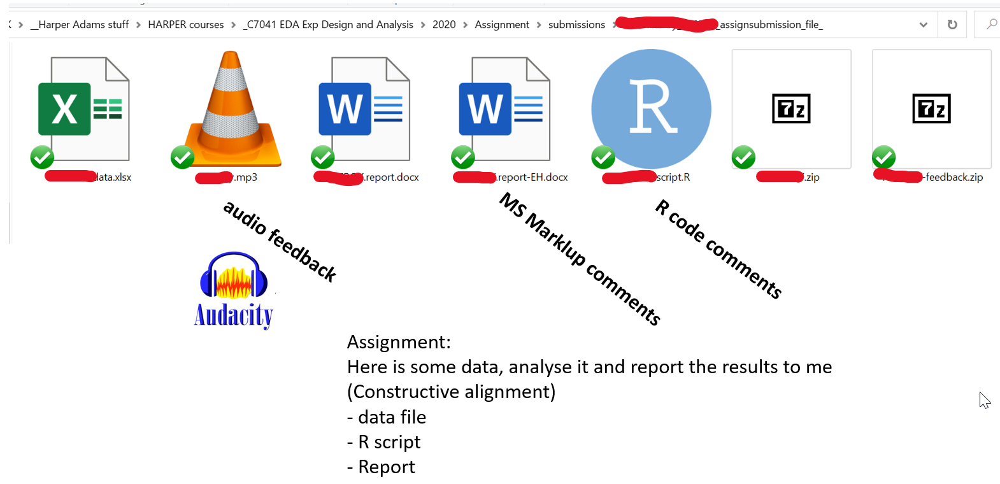
```

</center>

## a bag of tricks

***Trick # 3* Formative assessment<br>**
**(small tasks are especially good) **

Build it up over time, see what works

<center>

```{r, echo=FALSE, out.width="70%", fig.cap=""}
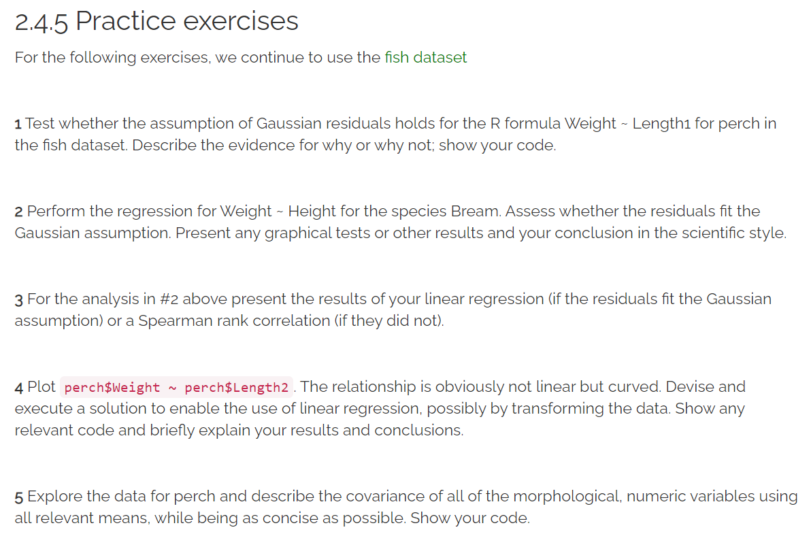
```

</center>

## a bag of tricks

***Trick # 3* Formative assessment**

Build it up over time, see what works

<center>

```{r, echo=FALSE, out.width="85%", fig.cap=""}
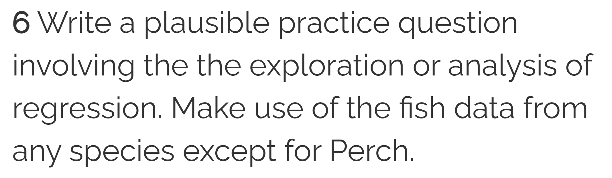
```

</center>

## a bag of tricks

***Trick # 4* Curate a variety of resources**

Quality not quantity, organisation, be consistent

<center>

```{r, echo=FALSE, out.width="85%", fig.cap=""}
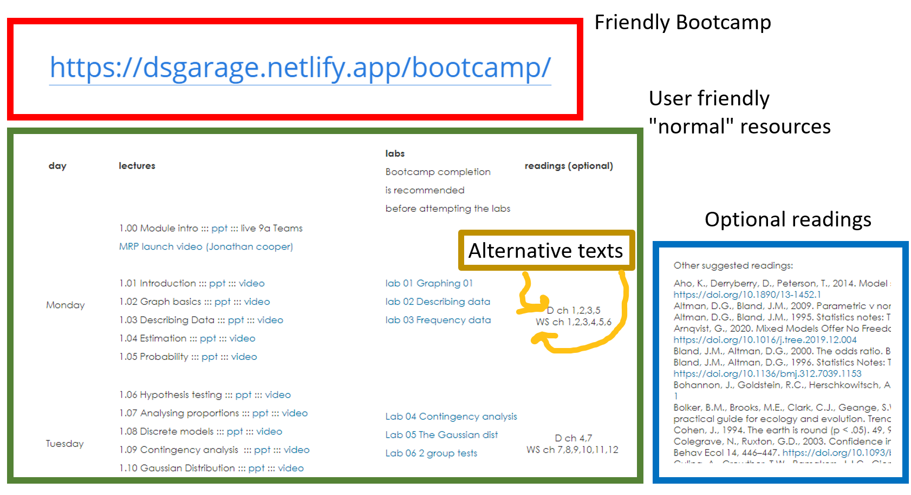
```

</center>

## a bag of tricks

***Trick # 5* Facilitate peer learning and interaction**

Boud et al 1999

>Peer learning approaches have been promoted to foster certain types or aspects of
lifelong learning skills which are not as readily pursued by other means...

- learning outcomes related to collaboration, and becoming a member of a
learning community

- critical enquiry and reflection

- communication skills

- learning to learn


## a bag of tricks

***Trick # 5* Facilitate peer learning and time to think**

Don't treat it as a one-time gimmick, make time for it formally

> Short tasks:

-- write you own quiz question, solve your neighbor's quiz question, rewrite Ed's quiz question but make it funny

> Longer tasks:

-- homework groups, breakout rooms

## pitfalls

**Pitfall # 1 Creepy white van**<br>

<center>

avoid forcing students and others to engage with a particular medium of content <br>
(especially social media, but other stuff too)

```{r, echo=FALSE, out.width="50%", fig.cap=""}

```

</center>


## pitfalls

**Pitfall # 2 Forgetting kindness**

<center>


```{r, echo=FALSE, out.width="60%", fig.cap=""}
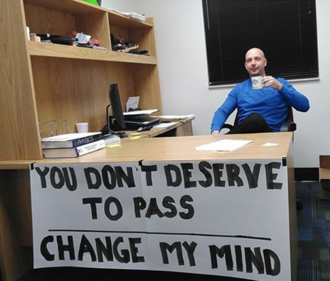
```

</center>

## suggested readings 

(optional, of course)

[Biggs, J., 1996. Enhancing teaching through constructive alignment. High Educ 32, 347-364.]( https://doi.org/10.1007/BF00138871)

[Boud, D., Cohen, R., Sampson, J., 1999. Peer Learning and Assessment. Assessment & Evaluation in Higher Education 24, 413-426.](https://doi.org/10.1080/0260293990240405)

[Dunn, R., 1984. Learning style: State of the science. Theory Into Practice 23, 10-19.]( https://doi.org/10.1080/00405848409543084)

[Moskal, P., Dziuban, C., Hartman, J., 2013. Blended learning: A dangerous idea? The Internet and Higher Education, Blended Learning in Higher Education: Policy and Implementation Issues 18, 15-23.](https://doi.org/10.1016/j.iheduc.2012.12.001)
