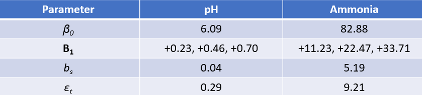
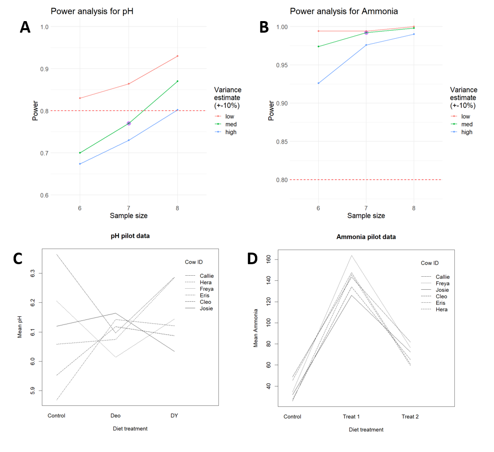

## Summary

The goal here was to simulate power for several sample size scenarios for a 4x4 Latin Square design.  A balanced Latin sq. design would typically have an equal replicate size for each cohort (e.g. n=8 [or another multiple of 4], with 2 individuals per cohort with 4 cohorts in a 4x4 design). However only 7 or 6 subjects are available.  The question is how does this affect power?  I assumed the analysis to be a linear mixed effects model (as an alternative to ANOVA for fully balanced design), with individual `Cow` as a random effect and `Diet` treatment (4 levels) as a fixed effect.

&nbsp;

$y_t = \beta_0 + \boldsymbol{B}_1 * (Diet) + (b_s)_t + \epsilon_t$ 

&nbsp;

where $\beta_0$ is the mean response, $\boldsymbol{B}_1$ is the matrix of Diet-specific effect estimates, $b_s$ is the random effect of subject $s$, and $\epsilon_t$ is the assumed-Gaussian residual error.

&nbsp;

Power analysis for linear mixed effects models can be challenging; here a simulation approach was used (e.g., see Kumle et al. 2021).  Pilot data were provided for two dependent variables, `pH` and `Ammonia`, and parameter for the simulation model were estimated based on them to simulate statistical power for detecting a treatment effect of `Diet` for $n=$ 8, 7 or 6 subjects. For each model, 500 datasets were simulated for each sample size, and each sample size was modeled for the observed pilot variance, for +10% observed pilot variance and for -10% observed variance (`med`, `high` and `low`, respectively). The `{lme4}` package (Bates et al. 2015) was used for the linear mixed effects modelling using R v 4.3.0 (R Core Team 2023).  The pilot data only contained three feed treatments, so the four treatment experiment was modeled using the observed treatment extremes, with an extrapolated monotonic increase in effect size for the two other treatments within the range of extremes.

&nbsp;

Table 1. The parameter sets used for power simulations.

\newpage

## Results

Figure 1. Panels `A` and `B` contain the power analysis results for pH and Ammonia, respectively. The red horizontal dashed line indicates 80% power. Each solid line represents a variance value across n = 6,7 or 8 cows.  The purple dot indicates expected power for the pilot data parameterised variance (`med`) for n = 7 cows. Panels `C` and `D` show pilot data for `pH` and `Ammonia`, respectively. Each line represents a different `Cow`.  

&nbsp;

The expected power for n=7 for `pH` is slightly below 80% power, while the expected power for all replicate sizes are far above 80% power for `Ammonia.`

&nbsp;

\newpage

## References

Bates, D., Maechler, M., Bolker, B., Walker, S. 2015. Fitting Linear Mixed-Effects Models Using lme4. Journal of Statistical Software, 67(1), 1-48. doi:10.18637/jss.v067.i01.
  
Kumle, L., Võ, M.L.-H., Draschkow, D., 2021. Estimating power in (generalized) linear mixed models: An open introduction and tutorial in R. Behav Res 53, 2528–2543. https://doi.org/10.3758/s13428-021-01546-0

R Core Team 2023. R: A Language and Environment for
Statistical Computing. R Foundation for Statistical
Computing, Vienna, Austria. <https://www.R-project.org/>.
